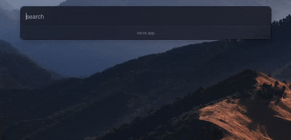
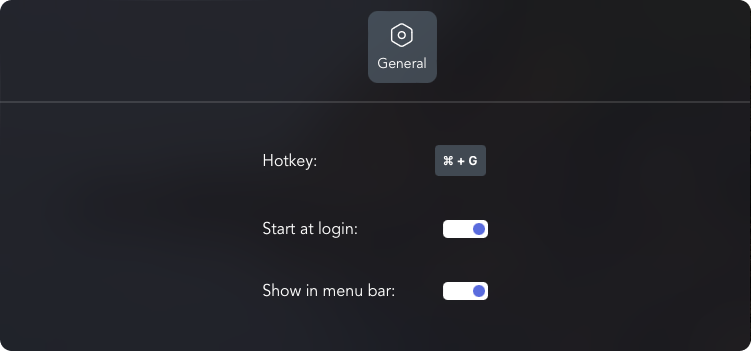

Verve is a lightweight and blazingly fast launcher for accessing and opening applications, files and documents. It serves as a replacement for popular tools such as Spotlight, Raycast, and Alfred, and is written in the Rust programming language using the Tauri Framework.

🚧 Despite being in the early stages of development, Verve is already showing great promise as a reliable and efficient tool for organizing and accessing important information on your computer. We are actively seeking contributors to help us continue improving and expanding the capabilities of Verve. If you are interested in getting involved and making a positive impact on this exciting project, we welcome your participation.

## 📥 Preview

<small>If preview is not loaded, please visit here [preview gif](./docs/preview.gif).</small>





## 📥 Downloading

To download Verve, visit the [releases section](https://github.com/ParthJadhav/verve/releases) of the project's repository on GitHub. There, you will find the latest version of the app available for download in the form of a DMG file. Simply click on the download link and follow the prompts to install the app on your computer.

📌 It's worth noting that the default shortcut for opening Verve is `CMD + Shift + G`, and this can be changed from the preferences section within the app. This allows you to customize the app to your specific needs and preferences, making it even more convenient and easy to use.

## 💫 Upcoming Features

- Extension support [Linked Issue](https://github.com/ParthJadhav/verve/issues/13)
- Let users theme the app by adding a customization interface in the Preferences window [Linked Issue](https://github.com/ParthJadhav/verve/issues/1)
- Add a calculator feature that allows users to perform calculations and conversions using natural language input [Linked Issue](https://github.com/ParthJadhav/verve/issues/2)
- Add a scroll feature to display all search results [Linked Issue](https://github.com/ParthJadhav/verve/issues/3)
- Replace icons with generic extension-based icons [Linked Issue](https://github.com/ParthJadhav/verve/issues/4)
- Create a Homebrew package for easy installation [Linked Issue](https://github.com/ParthJadhav/verve/issues/5)
- Implement an algorithm to search within Preferences [Linked Issue](https://github.com/ParthJadhav/verve/issues/8)
- Allow users to change the full search path [Linked Issue](https://github.com/ParthJadhav/verve/issues/9)

## ❤️ Donations & Support

Verve is an open-source project, and we rely on the support of our community to continue developing and improving the application. Although Verve is free to use, we welcome donations from those who have found it to be a valuable tool and would like to contribute to its development.

Your donations will help us to fund development efforts and speed up the pace of progress on the project. We are committed to continuing to improve and expand the capabilities of Verve, and your support will allow us to do so more quickly and effectively.

Please note that Verve is and will always be free to use. Your donation is entirely voluntary and will not be required in order to continue using the application. However, if you are able to contribute and would like to support the development of Verve, we appreciate your generosity and support. Thank you for considering a donation.

<a href='https://ko-fi.com/S6S2HCLM7' target='_blank'></a>

Find more options on right side of this page. Or by clicking Sponsor ❤️ button on top of this page.

## 🤝 Contributing

To get Verve set up on your machine, you'll need to have Rust and Yarn installed. Then, follow these steps:

1. Clone the project using `git clone https://github.com/ParthJadhav/verve.git`
2. Change into the project directory: `cd verve`
3. Install dependencies: `yarn`
4. Run the development server: `yarn tauri dev`

If you encounter any issues, try running `yarn tauri build` after installing dependencies.

## 🛠️ Building for Production

### Adding Targets:

```bash
rustup target add aarch64-apple-darwin
rustup target add x86_64-apple-darwin
```

### Building:
```bash
yarn package-and-build
```

This will create a production build of the app both `aarch64` & `x86_64` systems in the `src-tauri/target` directory.

All contributions from the open-source community, individuals, and partners are welcomed. Our achievement is a result of your active participation.

Checkout [Issues section](https://github.com/ParthJadhav/verve/issues) to find out what needs to be done.

[Contributing guidelines](docs/CONTRIBUTING.md)

[Code of conduct](CODE_OF_CONDUCT.md)

## 📝 License

Verve is licensed under the GNU AFFERO GENERAL PUBLIC LICENSE. See the [LICENSE file](./LICENCE) for more information.
