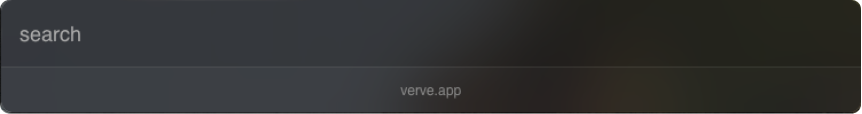
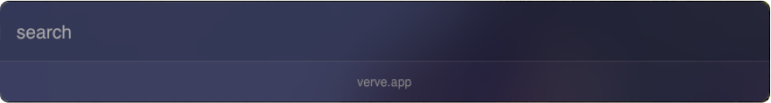
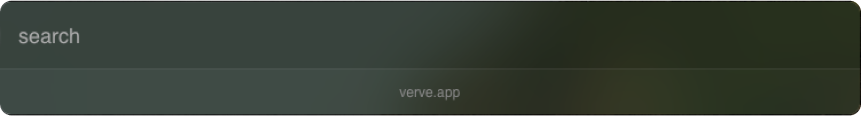

# 🎨 Themes

Download and Paste the theme file in

`/Users/<Username>/Library/Application Support/com.parth-jadhav.verve/theme.json`

and restart the app to see the changes.

Download: [theme-default.json](./themes/theme-default/theme.json)

Download: [theme-blue.json](./themes/theme-blue/theme.json)

Download: [theme-green.json](./themes/theme-green/theme.json)

### Create your own theme

You can create your own theme by editing the theme.json file. You can find the theme.json file in the following location:

`/Users/<Username>/Library/Application Support/com.parth-jadhav.verve/theme.json`

Save the file & Restart the app.

Create a Pull request to add your theme to the list.